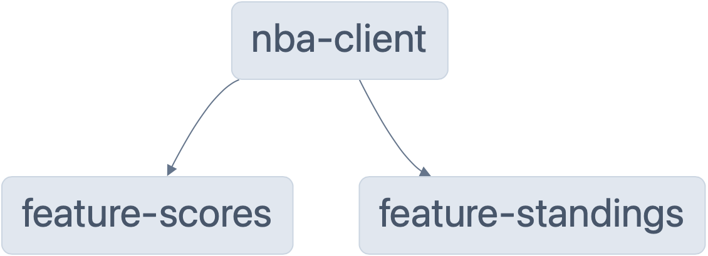

# NBA Next App

<table>
  <thead>
    <tr>
      <th rowspan="2">Overall</th>
      <th rowspan="2">NBA Client</th>
      <th colspan="2">Feature</th>
      <th>Libs</th>
    </tr>
    <tr>
      <th>Standings</th>
      <th>Scores</th>
      <th>UI</th>
    </tr>
  </thead>
  <tbody>
    <tr>
      <td>
        
      </td>
      <td align="center">
        
      </td>
      <td align="center">
        
      </td>
      <td align="center">
        
      </td>
      <td align="center">
        
      </td>
    </tr>
  </tbody>
</table>

## Live URL

- Visit [nba-next.matiushariman.com](https://nba-next.matiushariman.com)

## Tech Stack
- NX
- NextJS
- Typescript
- @mui
- swr
- msw
- Jest, RTL, Playwright

## Mental Model

In order to encourage modularity, scalability and maintainability, the app is broken down into what's called as `features`.

Each `feature` will handle specific use cases and can be imported by the main app as component.



## Setting up your development environment

Run the commands below to setup the app for development purpose

```shell
# clone the repository
git clone https://github.com/matiushariman/nba-next-app.git

# Install dependencies
yarn install
```

## Development server

Run `yarn dev` for a dev server. Navigate to http://localhost:4200/. The app will automatically reload if you change any of the source files.

## Unit & Integration Tests

To ensure the quality of the code and most importantly the app works as expected, unit test is implemented using Jest and RTL.

For more seamless integration testing experience, API is mocked in testing environment with MSW.

## E2E Test

E2E test is to be implemented using Playwright.


## Additional Notes

- Data is provided by [NBA API](sg.global.nba.com).
